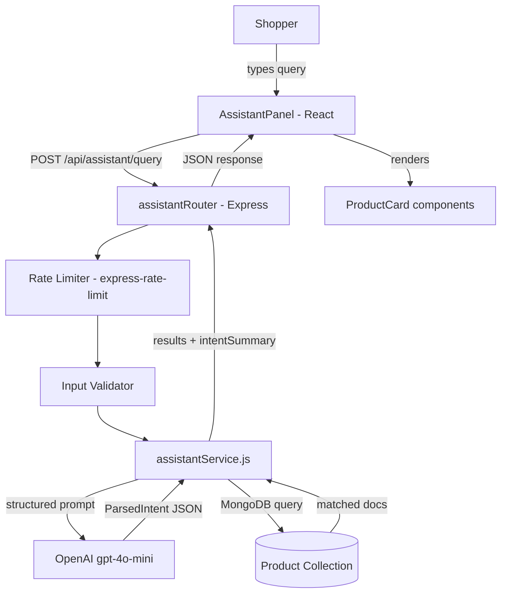

# Design Document: AI Shopping Assistant

## Overview

The AI Shopping Assistant adds a floating chat panel to Joota Junction's storefront that lets shoppers describe what they want in plain language and receive matching products instantly. It sits alongside the existing visual search feature as a complementary discovery tool.

The assistant uses OpenAI's `gpt-4o-mini` to parse natural language into structured intent (brand, category, price range, color, use case), then queries MongoDB using text search and in-memory filtering — no paid vector databases or external search services. Conversation history is kept client-side only (up to 5 turns), and the backend endpoint is rate-limited to 30 requests per minute per IP.

### Key Design Decisions

- **gpt-4o-mini for intent parsing only**: The model is called once per query to extract a structured JSON object. It is never used for generative responses, keeping token usage and cost minimal.
- **MongoDB text search + in-memory filter**: The existing Product collection already has `name`, `brand`, `category`, and `description` fields. A MongoDB `$text` index covers broad matching; in-memory filtering applies price bounds and exact brand/category normalization. This avoids any paid search service.
- **Client-side conversation history**: Prior turns are stored in React state only. The backend receives only the current query, keeping the API stateless and preventing token accumulation.
- **Reuse existing patterns**: The route follows `server/routes/visualSearch.js`, the OpenAI call follows `server/services/descriptionGeneratorService.js`, and the panel UI follows `src/components/VisualSearchModal.tsx`.

---

## Architecture



### Request Flow

1. Shopper types a query (or selects a suggested query) in the `AssistantPanel`.
2. Frontend POSTs `{ query: string }` to `/api/assistant/query`.
3. Express rate limiter checks the IP; rejects with 429 if over limit.
4. Input validator checks length (1–500 chars); rejects with 400 if invalid.
5. `assistantService` sends a structured prompt to `gpt-4o-mini` requesting a JSON `ParsedIntent`.
6. Service builds a MongoDB query from `ParsedIntent` and executes it.
7. Results are trimmed to 8, total count is preserved, and an `intentSummary` string is generated.
8. Response `{ results, parsedIntent, intentSummary, totalCount }` is returned to the frontend.
9. `AssistantPanel` renders results using the existing `ProductCard` component.

---

## Components and Interfaces

### Frontend Components

#### `AssistantButton` (new)
A fixed floating action button rendered in `App.tsx` outside the route tree (similar to `CartSidebar`). Visible on all non-admin pages.

```tsx
// Props
interface AssistantButtonProps {
  onClick: () => void;
}
```

#### `AssistantPanel` (new)
The main chat panel. Manages local conversation state, renders suggested queries, the text input, loading states, and results.

```tsx
interface AssistantPanelProps {
  isOpen: boolean;
  onClose: () => void;
}

interface ConversationTurn {
  query: string;
  results: Product[];
  parsedIntent: ParsedIntent;
  intentSummary: string;
  totalCount: number;
}

interface ParsedIntent {
  brand?: string;
  category?: string;
  useCase?: string;
  color?: string;
  minPrice?: number;
  maxPrice?: number;
  sortBy?: 'price_asc' | 'price_desc' | 'rating' | 'newest';
  referenceProduct?: string;
}
```

State managed inside `AssistantPanel`:
- `turns: ConversationTurn[]` — capped at 5, stored in `useState`
- `inputValue: string`
- `isLoading: boolean`
- `error: string | null`

#### `SuggestedQueries` (new, sub-component of `AssistantPanel`)
Renders the 4 pre-written example chips. Hidden while loading or when at least one turn exists.

```tsx
interface SuggestedQueriesProps {
  queries: string[];
  onSelect: (query: string) => void;
}
```

Suggested queries (hardcoded):
1. "Show me running shoes under ₹5,000"
2. "Find something like Nike Air Max but cheaper"
3. "White casual sneakers for men"
4. "Best rated Adidas shoes"

#### API client function (in `src/lib/assistantApi.ts`)

```ts
export async function queryAssistant(query: string): Promise<AssistantResponse>
```

### Backend Components

#### `server/routes/assistant.js` (new)
Registers `POST /api/assistant/query` with rate limiter and delegates to `assistantService`.

#### `server/services/assistantService.js` (new)
Core logic:
- Builds the OpenAI prompt
- Calls `gpt-4o-mini` with `max_tokens: 300`
- Parses the JSON response into `ParsedIntent`
- Normalizes brand/category values
- Builds and executes the MongoDB query
- Handles similar-product search
- Generates `intentSummary`

---

## Data Models

### `ParsedIntent` (runtime object, not persisted)

| Field | Type | Description |
|---|---|---|
| `brand` | `string \| null` | Normalized brand name (e.g., "Nike") |
| `category` | `string \| null` | Normalized category (e.g., "Running") |
| `useCase` | `string \| null` | Use case extracted from query (e.g., "gym") |
| `color` | `string \| null` | Color mentioned in query |
| `minPrice` | `number \| null` | Lower price bound in INR |
| `maxPrice` | `number \| null` | Upper price bound in INR |
| `sortBy` | `enum \| null` | One of: `price_asc`, `price_desc`, `rating`, `newest` |
| `referenceProduct` | `string \| null` | Product name used as similarity anchor |

### API Request / Response

**Request** `POST /api/assistant/query`
```json
{ "query": "running shoes under 5000" }
```

**Response** `200 OK`
```json
{
  "results": [ /* up to 8 Product documents */ ],
  "parsedIntent": {
    "category": "Running",
    "maxPrice": 5000
  },
  "intentSummary": "Showing running shoes under ₹5,000",
  "totalCount": 14
}
```

**Error responses**

| Status | Condition |
|---|---|
| 400 | `query` missing, empty, or > 500 chars |
| 429 | Rate limit exceeded (30 req/min per IP) |
| 503 | `OPENAI_API_KEY` not configured |
| 502 | OpenAI API error or timeout |
| 500 | Unexpected server error |

### MongoDB Query Strategy

The service builds a query object progressively from `ParsedIntent`:

```js
// 1. Text search on name + description (if brand/category/useCase present)
const filter = {};
if (textTerms.length) filter.$text = { $search: textTerms.join(' ') };

// 2. Exact brand match (case-insensitive regex after normalization)
if (parsedIntent.brand) filter.brand = new RegExp(`^${escaped}$`, 'i');

// 3. Exact category match
if (parsedIntent.category) filter.category = new RegExp(`^${escaped}$`, 'i');

// 4. Price range using effectivePrice (discountedPrice ?? price)
// Applied as in-memory filter after MongoDB fetch to handle discountedPrice
// MongoDB fetch uses a broad price filter; in-memory pass applies exact bounds

// 5. Similar product: exclude reference product _id, match category
```

The `$text` index must be created on `{ name: 'text', description: 'text', brand: 'text', category: 'text' }`. A migration script will create it if absent.

### Brand / Category Normalization

`assistantService` loads distinct brand and category values from MongoDB at startup (cached in memory, refreshed every 10 minutes). When `ParsedIntent` contains a brand or category string, the service finds the closest match using case-insensitive comparison before querying.

---

## Correctness Properties

*A property is a characteristic or behavior that should hold true across all valid executions of a system — essentially, a formal statement about what the system should do. Properties serve as the bridge between human-readable specifications and machine-verifiable correctness guarantees.*


### Property 1: Input length acceptance

*For any* string of 1–500 characters, the `AssistantPanel` input field should accept it and allow submission.

**Validates: Requirements 3.1**

### Property 2: Whitespace query rejection

*For any* string composed entirely of whitespace characters (spaces, tabs, newlines), the `AssistantPanel` should block submission and display a validation message, leaving the conversation state unchanged.

**Validates: Requirements 3.3**

### Property 3: Over-length query rejection

*For any* string with length > 500 characters, the `AssistantPanel` should block submission and display a character-limit message, leaving the conversation state unchanged.

**Validates: Requirements 3.4**

### Property 4: Price filter correctness

*For any* `ParsedIntent` that contains a `maxPrice` value, all products returned by `assistantService` should have an effective price (i.e., `discountedPrice ?? price`) less than or equal to `maxPrice`. Similarly, if `minPrice` is set, all returned products should have effective price >= `minPrice`.

**Validates: Requirements 4.2**

### Property 5: Brand and category normalization

*For any* brand or category string extracted by the OpenAI model, the service should match it case-insensitively against the catalog's known values and substitute the canonical stored form before querying MongoDB.

**Validates: Requirements 4.5**

### Property 6: Non-empty ParsedIntent for parseable queries

*For any* user query string that contains a recognizable intent signal (brand name, category, price, color, or use case), the `assistantService` should return a `ParsedIntent` object with at least one non-null field.

**Validates: Requirements 4.6**

### Property 7: Result count cap

*For any* MongoDB result set of any size, the `results` array in the API response should contain at most 8 products.

**Validates: Requirements 5.1**

### Property 8: Total count accuracy

*For any* query where the full matching set contains more than 8 products, the `totalCount` field in the response should equal the actual number of matching products in the catalog (not the capped 8).

**Validates: Requirements 5.5**

### Property 9: Conversation history cap

*For any* sequence of queries submitted in a single session, the `turns` array in `AssistantPanel` state should never exceed 5 entries; the oldest turn should be dropped when a 6th is added.

**Validates: Requirements 6.1**

### Property 10: Stateless API — no history in request

*For any* conversation state with 1–5 prior turns, the POST body sent to `/api/assistant/query` should contain only the `query` field and no history or prior turn data.

**Validates: Requirements 6.2**

### Property 11: Reference product excluded from similar results

*For any* similar-product query where a reference product is identified in the catalog, that reference product's `_id` should not appear in the returned `results` array.

**Validates: Requirements 7.2**

### Property 12: Response shape invariant

*For any* valid query that returns HTTP 200, the response JSON should always contain all four fields: `results` (array), `parsedIntent` (object), `intentSummary` (non-empty string), and `totalCount` (non-negative integer).

**Validates: Requirements 8.2**

### Property 13: Input validation returns 400

*For any* request to `POST /api/assistant/query` where `query` is absent, empty, whitespace-only, or longer than 500 characters, the service should return HTTP 400 without calling the OpenAI API.

**Validates: Requirements 8.6**

### Property 14: MongoDB query sanitization

*For any* `ParsedIntent` field value containing special characters (e.g., `$`, `.`, regex metacharacters), the constructed MongoDB query should treat them as literal strings and not execute unintended query operators.

**Validates: Requirements 9.4**

---

## Error Handling

### Frontend

| Condition | Behavior |
|---|---|
| Network error / fetch failure | Show dismissible error banner: "Something went wrong. Please try again." |
| HTTP 429 | Show: "Too many requests. Please wait a moment before trying again." |
| HTTP 400 | Show inline validation message (should not reach here if client validates first) |
| HTTP 502/503 | Show: "Assistant is temporarily unavailable." |
| Empty results | Show "No products found" state with suggested queries re-displayed |

### Backend

| Condition | HTTP Status | Response |
|---|---|---|
| Missing / empty `query` | 400 | `{ "error": "query must be a non-empty string of at most 500 characters" }` |
| `query` > 500 chars | 400 | `{ "error": "query must be a non-empty string of at most 500 characters" }` |
| Rate limit exceeded | 429 | `{ "error": "Too many requests. Try again after <ISO timestamp>." }` |
| `OPENAI_API_KEY` missing | 503 | `{ "error": "Assistant is not configured." }` (+ server log) |
| OpenAI timeout (10 s) | 502 | `{ "error": "Intent parsing timed out. Please try again." }` |
| OpenAI API error | 502 | `{ "error": "Intent parsing failed. Please try again." }` |
| OpenAI returns unparseable JSON | 502 | `{ "error": "Intent parsing failed. Please try again." }` |
| MongoDB query error | 500 | `{ "error": "Product search failed. Please try again." }` |

The service wraps the OpenAI call in a `Promise.race` against a 10-second timeout to satisfy Requirement 4.3.

---

## Testing Strategy

### Dual Testing Approach

Both unit tests and property-based tests are required. They are complementary:
- Unit tests verify specific examples, integration points, and error conditions.
- Property-based tests verify universal correctness across randomized inputs.

### Unit Tests

**Backend (`server/services/assistantService.test.js`)**
- OpenAI timeout triggers 502 response
- Missing API key triggers 503 response
- Reference product found → its `_id` excluded from results
- Reference product not found → falls back to category search
- `intentSummary` is generated correctly for various `ParsedIntent` shapes
- Rate limiter returns 429 after 30 requests

**Frontend (`src/components/AssistantPanel.test.tsx`)**
- Suggested queries render on initial open
- Suggested queries hidden during loading
- Suggested queries re-shown on empty results
- Clicking a suggested query populates input and submits
- Clear conversation resets to initial state
- Product click closes panel and navigates

### Property-Based Tests

Use **fast-check** (frontend, already available via `@tanstack/react-query` ecosystem) and **fast-check** on the backend (Node.js compatible).

Each property test runs a minimum of **100 iterations**.

Tag format: `Feature: ai-shopping-assistant, Property {N}: {property_text}`

| Property | Test description | Library |
|---|---|---|
| P1: Input length acceptance | Generate strings of length 1–500; assert input accepts and submit is enabled | fast-check (frontend) |
| P2: Whitespace query rejection | Generate strings of only `\s` chars; assert submission blocked | fast-check (frontend) |
| P3: Over-length query rejection | Generate strings of length 501–2000; assert submission blocked | fast-check (frontend) |
| P4: Price filter correctness | Generate random ParsedIntent with minPrice/maxPrice; assert all returned products satisfy bounds | fast-check (backend) |
| P5: Brand/category normalization | Generate brand strings with random casing; assert canonical form used in query | fast-check (backend) |
| P6: Non-empty ParsedIntent | Generate queries with known intent signals; assert at least one field non-null | fast-check (backend) |
| P7: Result count cap | Generate result sets of 1–100 products; assert response.results.length <= 8 | fast-check (backend) |
| P8: Total count accuracy | Generate result sets > 8; assert totalCount equals full set size | fast-check (backend) |
| P9: Conversation history cap | Generate sequences of 1–20 queries; assert turns.length <= 5 | fast-check (frontend) |
| P10: Stateless API | Generate conversation state with 1–5 turns; assert POST body contains only `query` | fast-check (frontend) |
| P11: Reference product excluded | Generate catalog + reference product; assert reference _id absent from results | fast-check (backend) |
| P12: Response shape invariant | Generate valid queries; assert all four response fields present and typed correctly | fast-check (backend) |
| P13: Input validation returns 400 | Generate invalid inputs (empty, whitespace, >500 chars); assert HTTP 400, no OpenAI call | fast-check (backend) |
| P14: MongoDB query sanitization | Generate ParsedIntent fields with `$`, `.`, regex chars; assert no MongoDB operator injection | fast-check (backend) |
