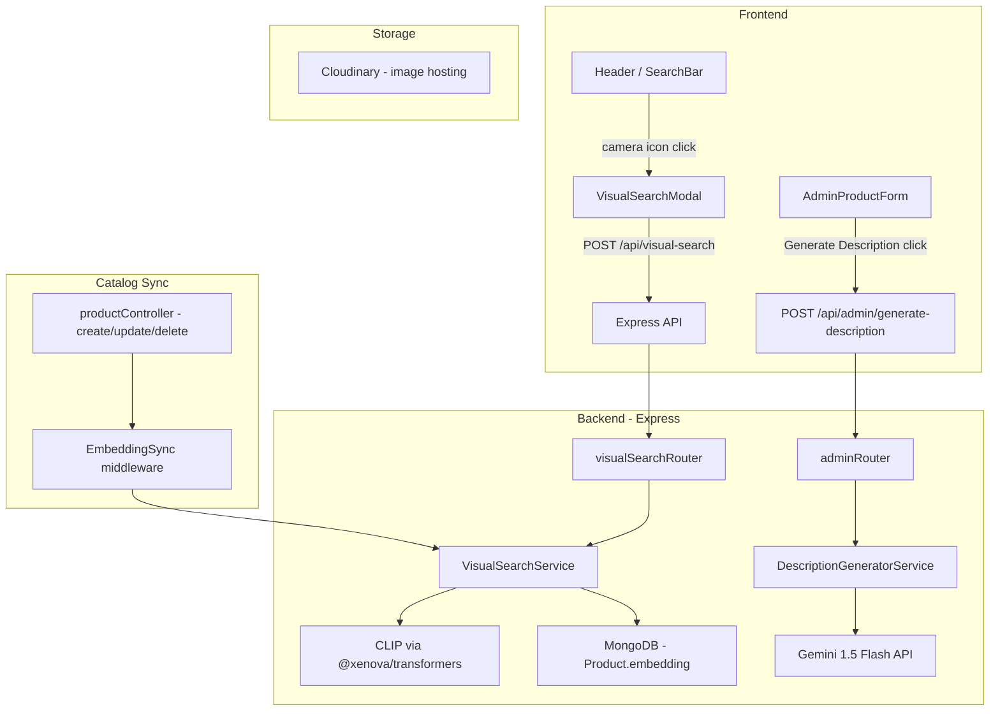

# Design Document: AI Visual Search & Product Descriptions

## Overview

This document covers the technical design for two AI/ML features added to Joota Junction:

1. **Visual Search** — shoppers upload a shoe photo and receive visually similar products ranked by embedding similarity.
2. **AI-Generated Product Descriptions** — admins upload a product image and receive a ready-to-use description generated by Google Gemini Vision.

Both features are additive: they introduce new backend services, new API routes, and targeted frontend changes without restructuring the existing Express/MongoDB/React stack.

### AI Provider Decisions

**Visual Search — `@xenova/transformers` (CLIP) in Node.js**

The two realistic options are a Python microservice running CLIP or running CLIP directly in Node via `@xenova/transformers`. The Python microservice adds operational complexity (separate process, health checks, inter-service HTTP, deployment coordination). `@xenova/transformers` runs the same CLIP ViT-B/32 model in-process via ONNX Runtime, produces identical 512-dimensional embeddings, and requires no additional infrastructure. For a catalog of hundreds to low-thousands of products this is the practical choice. The first inference call triggers a one-time model download (~170 MB); subsequent calls are fast.

**Description Generation — Google Gemini 1.5 Flash**

Gemini 1.5 Flash accepts image bytes directly, has a generous free tier, and produces high-quality shoe descriptions. The API is a single HTTPS call — no SDK installation required beyond `node-fetch` or the `@google/generative-ai` package.

**Vector Storage — MongoDB embedding arrays + cosine similarity in the service layer**

Atlas Vector Search requires M10+ clusters. Pinecone adds a third-party dependency and cost. For a catalog that fits comfortably in memory (< ~50k products), storing a `Float32Array`-serialized embedding on each product document and computing cosine similarity in Node is fast enough (< 100 ms for 10k products) and keeps the stack simple. If the catalog grows beyond ~50k products, the design can be migrated to Atlas Vector Search by adding an index — the embedding field and service interface remain unchanged.

---

## Architecture



### Request Flow — Visual Search

1. User drops/selects an image in `VisualSearchModal`.
2. Frontend POSTs `multipart/form-data` to `POST /api/visual-search`.
3. Rate limiter checks IP (20 req/min).
4. `VisualSearchService.search(imageBuffer)`:
   a. Validates MIME type and file size.
   b. Runs CLIP inference → 512-d embedding vector.
   c. Loads all product embeddings from MongoDB (projected fields only).
   d. Computes cosine similarity against each embedding.
   e. Filters out-of-stock products and scores below 0.3.
   f. Returns top-12 results sorted by descending score.
5. Response includes product fields + `similarityScore`.
6. Frontend renders results using existing `ProductCard`.

### Request Flow — Description Generation

1. Admin clicks "Generate Description" in `AdminProductForm`.
2. Frontend POSTs the already-uploaded Cloudinary image URL to `POST /api/admin/generate-description`.
3. Rate limiter checks per-user (50 req/hr).
4. `DescriptionGeneratorService.generate(imageUrl)`:
   a. Fetches image bytes from Cloudinary URL.
   b. Sends image + structured prompt to Gemini 1.5 Flash.
   c. Validates response length (50–300 words).
   d. Returns description string.
5. Frontend populates the description textarea; admin can edit before saving.

---

## Components and Interfaces

### Backend Services

#### `VisualSearchService` (`server/services/visualSearchService.js`)

```js
class VisualSearchService {
  // Lazy-loads CLIP pipeline on first call
  async loadModel(): Promise<void>

  // Generates a 512-d Float32Array from an image buffer
  async generateEmbedding(imageBuffer: Buffer): Promise<Float32Array>

  // Main search: returns ranked products
  async search(imageBuffer: Buffer, topK?: number): Promise<SearchResult[]>

  // Upserts embedding for a single product image URL
  async indexProduct(productId: string, imageUrls: string[]): Promise<void>

  // Removes embeddings for a deleted product
  async removeProduct(productId: string): Promise<void>

  // Admin: rebuilds the full catalog index
  async rebuildIndex(): Promise<{ indexed: number; failed: number }>
}

interface SearchResult {
  product: ProductDocument   // name, brand, category, price, discountedPrice, images
  similarityScore: number    // 0–1
}
```

#### `DescriptionGeneratorService` (`server/services/descriptionGeneratorService.js`)

```js
class DescriptionGeneratorService {
  // Fetches image, calls Gemini, validates output
  async generate(imageUrl: string): Promise<string>
}
```

### New API Routes

#### `server/routes/visualSearch.js`

| Method | Path | Auth | Description |
|--------|------|------|-------------|
| `POST` | `/api/visual-search` | Public | Upload image, get similar products |
| `POST` | `/api/admin/visual-search/rebuild-index` | Admin | Trigger full catalog index rebuild |

#### Additions to `server/routes/admin.js`

| Method | Path | Auth | Description |
|--------|------|------|-------------|
| `POST` | `/api/admin/generate-description` | Admin | Generate description from image URL |

### Frontend Components

#### New: `VisualSearchModal` (`src/components/VisualSearchModal.tsx`)

- Triggered by a camera icon button added to the existing `Header` search bar.
- Renders a drag-and-drop / file-picker zone with image preview.
- On submit: calls `POST /api/visual-search`, shows loading state, then renders results in a grid of `ProductCard` components.
- "Clear" button resets state and returns focus to text search.
- Uses `@tanstack/react-query` `useMutation` for the upload call.

#### Modified: `Header` (`src/components/Header.tsx`)

- Adds a camera icon (`lucide-react` `Camera`) button to the right of the search input.
- Clicking it opens `VisualSearchModal`.

#### Modified: `AdminProductForm` (new page `src/pages/AdminProductForm.tsx` or inline in existing admin product create/edit pages)

- Adds a "Generate Description" button next to the description `<textarea>`.
- Button is disabled when no product image has been uploaded yet.
- While generating: button shows spinner + "Generating…" text, is disabled.
- On success: populates the description field (editable).
- On error: shows inline error toast.

---

## Data Models

### Product Model — Embedding Field Addition

The `embedding` field stores the CLIP vector for the product's **primary image** (index 0). Storing one embedding per product (rather than per image) keeps the similarity lookup O(n) with a small constant and is sufficient for shoe catalog search where the primary image is the canonical representation.

```js
// Addition to server/models/Product.js
embedding: {
  type: [Number],   // 512 floats — CLIP ViT-B/32 output dimension
  default: undefined,
  select: false,    // excluded from normal queries; fetched only by VisualSearchService
}
```

The field is marked `select: false` so it never appears in regular product API responses, keeping payload sizes unchanged.

### Embedding Index Strategy

- **On product create**: after saving, `VisualSearchService.indexProduct()` is called asynchronously (fire-and-forget with error logging). The product is immediately available in the catalog; it will appear in visual search results once indexing completes (typically < 2 s).
- **On product update** (images changed): same async call replaces the embedding.
- **On product delete**: `VisualSearchService.removeProduct()` clears the embedding field (or the document is gone — no action needed if using document deletion).
- **Full rebuild**: admin endpoint iterates all products in batches of 50, generates embeddings, bulk-writes to MongoDB.

### No Separate Embedding Collection

Embeddings live on the Product document. This avoids join complexity and keeps the data co-located. The `select: false` annotation ensures zero impact on existing API response sizes.

---

## Correctness Properties

*A property is a characteristic or behavior that should hold true across all valid executions of a system — essentially, a formal statement about what the system should do. Properties serve as the bridge between human-readable specifications and machine-verifiable correctness guarantees.*

### Property 1: Valid image formats are accepted by visual search

*For any* image buffer whose MIME type is `image/jpeg`, `image/png`, or `image/webp`, the `VisualSearchService` validation step should not reject the input — it should proceed to embedding generation without returning a format error.

**Validates: Requirements 1.1**

---

### Property 2: Oversized files are rejected by visual search

*For any* image buffer whose byte length exceeds 10,485,760 bytes (10 MB), the `VisualSearchService` SHALL reject the request and return an error response before any ML processing occurs.

**Validates: Requirements 1.2**

---

### Property 3: Oversized files are rejected by the description generator

*For any* image whose byte length exceeds 10,485,760 bytes (10 MB), the `DescriptionGeneratorService` SHALL reject the request and return an error response before calling the Gemini API.

**Validates: Requirements 5.3**

---

### Property 4: Non-image data is rejected before processing

*For any* byte sequence that does not parse as a valid JPEG, PNG, or WebP image (e.g., random bytes, text files, PDFs), the `VisualSearchService` input validation SHALL reject the input and return a descriptive error, ensuring no arbitrary data reaches the CLIP model.

**Validates: Requirements 1.3, 8.4**

---

### Property 5: Search results are bounded and sorted by similarity

*For any* query embedding and catalog of products with embeddings, the search results returned by `VisualSearchService.search()` SHALL contain at most 12 items, and the `similarityScore` values SHALL be in non-increasing order (each score ≥ the score of the next item).

**Validates: Requirements 2.1**

---

### Property 6: Out-of-stock products are excluded from search results

*For any* catalog containing a mix of in-stock and out-of-stock products, every product in the `VisualSearchService` result set SHALL have at least one `sizes` entry with `stock > 0`. No product where all sizes have `stock === 0` shall appear in results.

**Validates: Requirements 2.2**

---

### Property 7: Search result items contain all required fields

*For any* non-empty `VisualSearchService` result, every item in the result array SHALL contain the fields: `name`, `brand`, `category`, `price`, `images`, and `similarityScore`. The `discountedPrice` field SHALL be present (may be `null`/`undefined` for non-discounted products).

**Validates: Requirements 2.4**

---

### Property 8: ProductCard is rendered for each search result

*For any* non-empty array of visual search results passed to the `VisualSearchModal` results view, the rendered output SHALL contain exactly one `ProductCard` component per result item — no more, no fewer.

**Validates: Requirements 3.4**

---

### Property 9: Product embedding indexing round-trip

*For any* product that has been created or had its images updated and subsequently indexed by `VisualSearchService.indexProduct()`, the product's `embedding` field in MongoDB SHALL be a non-empty array of 512 numbers. Re-indexing the same product with a different primary image SHALL replace the previous embedding (the stored embedding reflects the current primary image, not a stale one).

**Validates: Requirements 4.1, 4.3**

---

### Property 10: Index rebuild is resilient to individual failures

*For any* catalog where one or more products have an inaccessible or corrupt primary image, calling `VisualSearchService.rebuildIndex()` SHALL still successfully generate and store embeddings for all products whose images are accessible. The failed products SHALL be counted in the `failed` return value, and the successful ones SHALL be counted in `indexed`. The rebuild SHALL not throw or abort early.

**Validates: Requirements 4.5**

---

### Property 11: Generated descriptions satisfy the word count constraint

*For any* valid shoe image submitted to `DescriptionGeneratorService.generate()`, the returned description string SHALL contain between 50 and 300 words (inclusive) when split on whitespace. Descriptions outside this range SHALL cause the service to return an error rather than the out-of-range text.

**Validates: Requirements 6.1**

---

## Error Handling

### Visual Search Errors

| Condition | HTTP Status | Response |
|-----------|-------------|----------|
| No file uploaded | 400 | `{ error: "No image file provided" }` |
| Unsupported MIME type | 400 | `{ error: "Unsupported format. Upload a JPEG, PNG, or WebP image." }` |
| File exceeds 10 MB | 400 | `{ error: "File too large. Maximum size is 10 MB." }` |
| CLIP model inference failure | 500 | `{ error: "Visual search temporarily unavailable. Please try again." }` |
| Rate limit exceeded | 429 | `{ error: "Too many requests. Try again after {resetTime}." }` |
| No results above threshold | 200 | `{ results: [], message: "No similar products found. Try browsing by category." }` |

### Description Generator Errors

| Condition | HTTP Status | Response |
|-----------|-------------|----------|
| Not authenticated | 401 | `{ error: "Authentication required." }` |
| Not admin | 403 | `{ error: "Admin access required." }` |
| No image URL provided | 400 | `{ error: "An image URL is required to generate a description." }` |
| Image fetch failure | 400 | `{ error: "Could not retrieve the image. Ensure the product image is uploaded first." }` |
| File exceeds 10 MB | 400 | `{ error: "Image too large. Maximum size is 10 MB." }` |
| Gemini API error / timeout | 502 | `{ error: "Description generation failed. Please try again or write a description manually." }` |
| Generated text out of range | 502 | `{ error: "Generated description was outside acceptable length. Please try again." }` |
| Rate limit exceeded | 429 | `{ error: "Description generation limit reached. Try again after {resetTime}." }` |

### Catalog Index Errors

- Embedding failures during product create/update are logged (`console.error`) and do not fail the product save operation. The product is created/updated successfully; it simply won't appear in visual search until the next successful index attempt or a manual rebuild.
- The admin rebuild endpoint returns `{ indexed: N, failed: M, errors: [...] }` so operators can identify which products need attention.

### Frontend Error Handling

- Visual search API errors surface as a dismissible error banner inside `VisualSearchModal` (not a full-page error).
- Description generation errors surface as an inline error message below the "Generate Description" button using `sonner` toast (consistent with existing admin UI patterns).
- Network errors (no connectivity) are caught by the `@tanstack/react-query` error state and display a generic retry prompt.

---

## Testing Strategy

### Dual Testing Approach

Both unit tests and property-based tests are required. They are complementary:

- **Unit tests** verify specific examples, integration points, edge cases, and error conditions.
- **Property-based tests** verify universal invariants across randomly generated inputs, catching edge cases that hand-written examples miss.

### Property-Based Testing

**Library**: [`fast-check`](https://github.com/dubzzz/fast-check) — the standard PBT library for JavaScript/TypeScript. Install in the server test environment:

```bash
npm install --save-dev fast-check vitest
```

Each property test must run a **minimum of 100 iterations** (fast-check default is 100; increase with `{ numRuns: 200 }` for critical properties).

Each test must include a comment tag in the format:
`// Feature: ai-visual-search-and-descriptions, Property N: <property_text>`

**Property test mapping:**

| Property | Test file | fast-check arbitraries |
|----------|-----------|------------------------|
| P1 — Valid formats accepted | `visualSearchService.test.js` | `fc.constantFrom('image/jpeg', 'image/png', 'image/webp')` + valid image buffer |
| P2 — Oversized files rejected (visual search) | `visualSearchService.test.js` | `fc.integer({ min: 10_485_761, max: 50_000_000 })` → buffer of that size |
| P3 — Oversized files rejected (description) | `descriptionGeneratorService.test.js` | Same size arbitrary |
| P4 — Non-image data rejected | `visualSearchService.test.js` | `fc.uint8Array({ minLength: 1, maxLength: 1_000_000 })` with non-image MIME |
| P5 — Results bounded and sorted | `visualSearchService.test.js` | `fc.array(fc.record({ embedding: fc.array(fc.float(), {minLength:512, maxLength:512}), ... }))` |
| P6 — Out-of-stock excluded | `visualSearchService.test.js` | `fc.array(productArbitrary)` with mixed stock states |
| P7 — Result fields present | `visualSearchService.test.js` | Same as P5 |
| P8 — ProductCard per result | `VisualSearchModal.test.tsx` | `fc.array(productArbitrary, { minLength: 1, maxLength: 12 })` |
| P9 — Embedding round-trip | `visualSearchService.test.js` | `fc.string()` product ID + `fc.array(fc.webUrl())` image URLs |
| P10 — Rebuild resilience | `visualSearchService.test.js` | `fc.array(productArbitrary)` with injected failures on random subset |
| P11 — Description word count | `descriptionGeneratorService.test.js` | Mock Gemini responses with `fc.string()` of varying lengths |

### Unit Tests

Unit tests focus on:

- **Integration points**: `POST /api/visual-search` route handler (multer → service → response shape), `POST /api/admin/generate-description` route handler.
- **Authorization examples**: unauthenticated request to visual search returns results (not 401); non-admin request to generate-description returns 403; admin request succeeds.
- **Edge cases**: empty catalog returns empty results; catalog with all out-of-stock products returns empty results; Gemini API timeout returns 502 without writing to DB.
- **Rate limiting**: 21st request from same IP to visual search returns 429 with reset header; 51st request from same admin account to description generator returns 429.
- **UI states**: loading indicator shown during pending mutation; "No similar products found" shown for empty result; clear button resets modal state.
- **Admin form**: "Generate Description" disabled when no image uploaded; button disabled + spinner shown during generation; description field populated and editable after success.

### Test File Structure

```
server/
  services/
    __tests__/
      visualSearchService.test.js   # P1–P7, P9–P10 + unit tests
      descriptionGeneratorService.test.js  # P3, P11 + unit tests
  routes/
    __tests__/
      visualSearch.route.test.js    # route-level integration tests
      adminAI.route.test.js         # description generator route tests

src/
  components/
    __tests__/
      VisualSearchModal.test.tsx    # P8 + UI unit tests
      AdminProductForm.test.tsx     # admin form unit tests
```

### Test Configuration

```js
// vitest.config.js (server)
export default {
  test: {
    globals: true,
    environment: 'node',
    setupFiles: ['./test/setup.js'],  // MongoDB in-memory setup
  }
}
```

Use `mongodb-memory-server` for database tests to avoid hitting the real MongoDB instance.

Mock `@xenova/transformers` pipeline in unit tests to return deterministic 512-d vectors, avoiding the 170 MB model download in CI.

Mock `@google/generative-ai` in unit tests to return controlled description strings.
